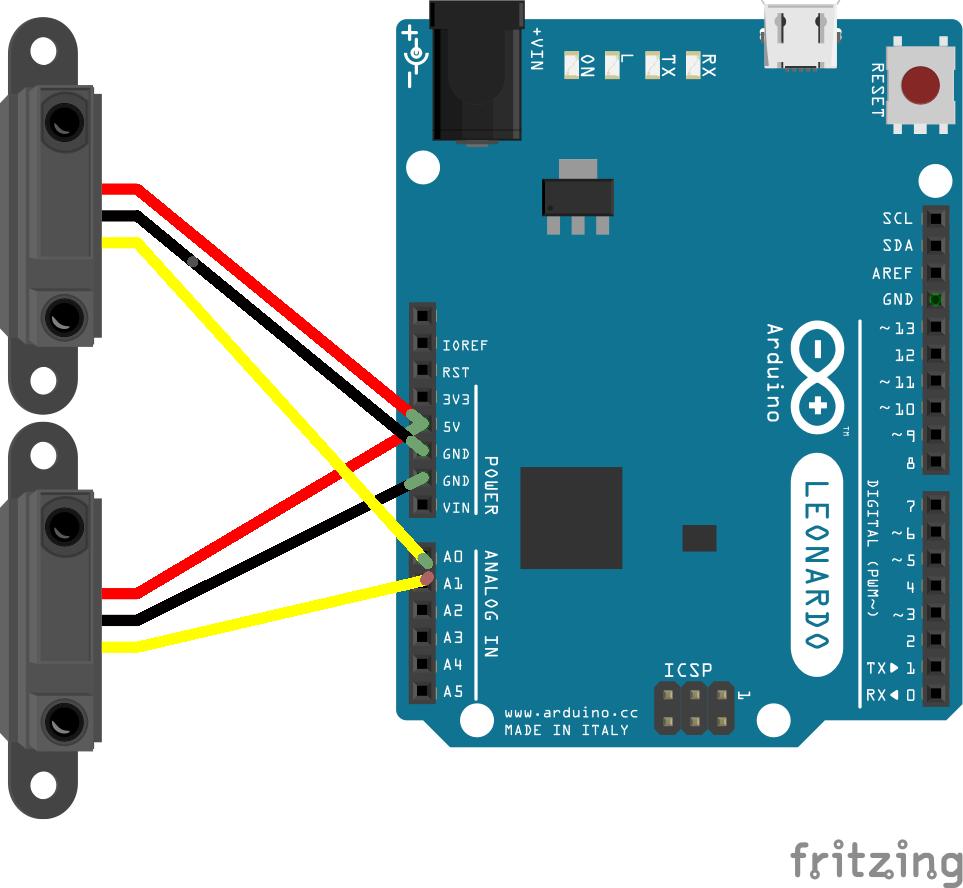

# veloce
Instrument for audiovisuals performances

Created and used for the first time at filmforum 2016 in Gorizia (Italy)

## How to use?

### Hardware

#### Arduino midi-controler
* On a arduino leonardo compatible board,  upload the noteout sketch located in the arduino folder.

* wire the sensors as illustrated 

* this sensor is perfect [http://www.robotshop.com/en/dfrobot-adjustable-infrared-sensor-switch.html](http://www.robotshop.com/en/dfrobot-adjustable-infrared-sensor-switch.html)

### Software

- Populate audioGranule with 49 wavfiles of your choice (short and deep is good !)
- Poulate the mov folder with about 20 short clips encoded in the hap codec
- Make sure your setup meet the dependencies

#### Software Dependencies

##### Max 7
https://cycling74.com/downloads/#.VvFKW8elNOo

##### hap codec
https://github.com/Vidvox/hap-qt-codec/releases/tag/version-9

##### Jit.gl.hap
https://cycling74.com/toolbox/jit-gl-hap/#.VvFJ9selNOo
